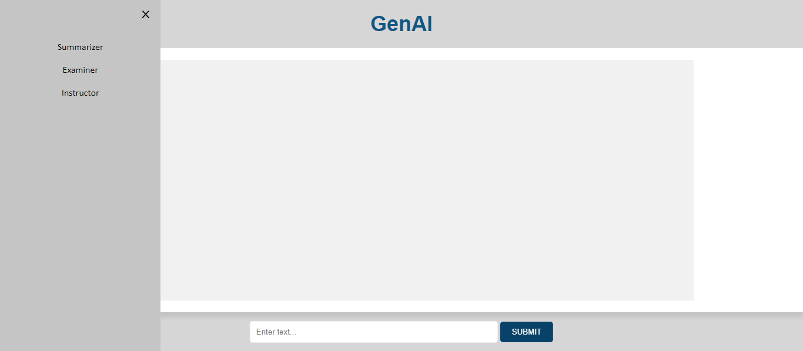
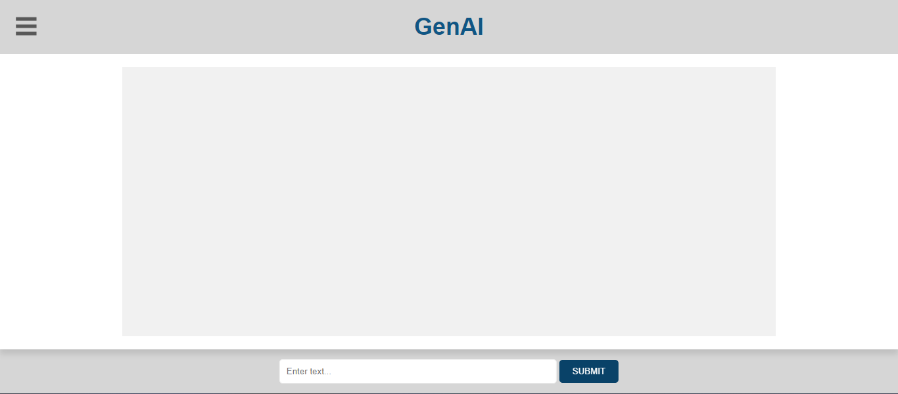

## How To
#### Prep
    Clone to your local
        (I've included the virtual env files in github just for convenience)
    Provide
        API Key and File: .env
        The Files You Want To Summarize/Work With
            ./app/data/
                Templates
                Context
#### Start
    Start Virtual Environment
        Paste In Terminal: .\.venv\Scripts\Activate.ps1
    Start Flask Server
        From Root Project Directory Run: flask run
#### Stop
    Stop Server: CTRL + C
    Exit Virt Env Command: deactivate

## Example

